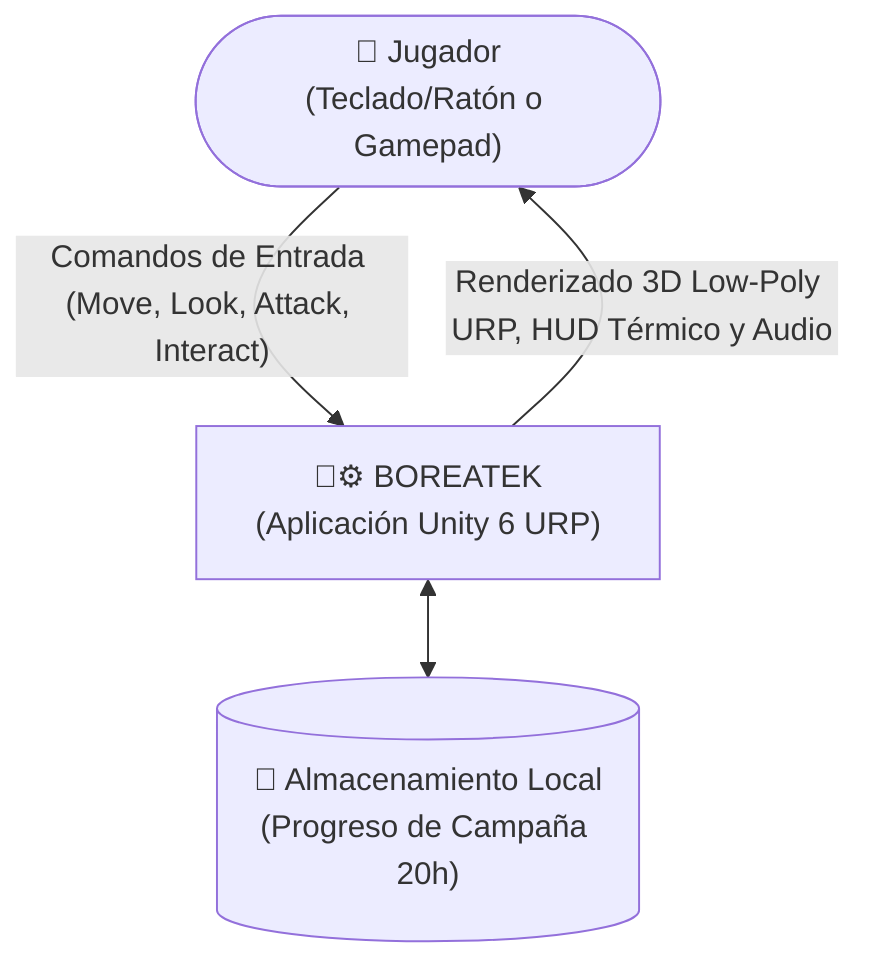
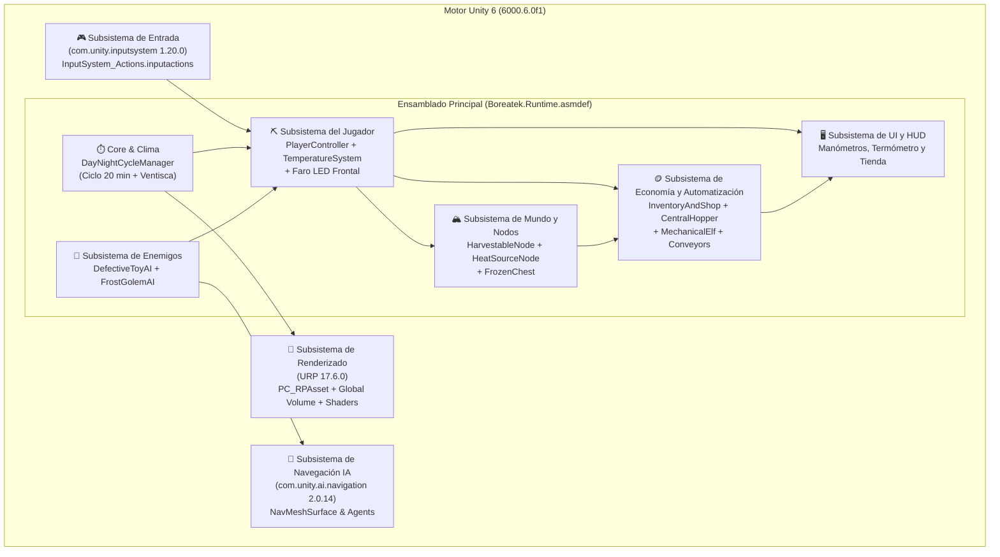

# Diagramas C4: Contexto y Contenedores de Subsistemas en Unity 6

---

## 1. Nivel C1 — Contexto del Sistema

```mermaid
flowchart TD
    Player(["👤 Jugador\n(Teclado/Ratón o Gamepad)"])
    Boreatek["🎄⚙️ BOREATEK\n(Aplicación Unity 6 URP)"]
    LocalDisk[("💾 Almacenamiento Local\n(Progreso de Campaña 20h)")]

    Player -- "Comandos de Entrada (Move, Look, Attack, Interact)" --> Boreatek
    Boreatek -- "Renderizado 3D Low-Poly URP, HUD Térmico y Audio" --> Player
    Boreatek <--> LocalDisk
```

---

## 2. Nivel C2 — Contenedores / Subsistemas Internos del Motor

```mermaid
flowchart TB
    subgraph UnityEngine["Motor Unity 6 (6000.6.0f1)"]
        InputSys["🎮 Subsistema de Entrada\n(com.unity.inputsystem 1.20.0)\nInputSystem_Actions.inputactions"]
        URPSys["🎨 Subsistema de Renderizado\n(URP 17.6.0)\nPC_RPAsset + Global Volume + Shaders"]
        NavSys["🧭 Subsistema de Navegación IA\n(com.unity.ai.navigation 2.0.14)\nNavMeshSurface & Agents"]

        subgraph BoreatekRuntime["Ensamblado Principal (Boreatek.Runtime.asmdef)"]
            CoreMgr["⏱️ Core & Clima\nDayNightCycleManager\n(Ciclo 20 min + Ventisca)"]
            PlayerSys["⛏️ Subsistema del Jugador\nPlayerController + TemperatureSystem\n+ Faro LED Frontal"]
            WorldSys["🏔️ Subsistema de Mundo y Nodos\nHarvestableNode + HeatSourceNode\n+ FrozenChest"]
            EconSys["🪙 Subsistema de Economía y Automatización\nInventoryAndShop + CentralHopper\n+ MechanicalElf + Conveyors"]
            AISys["🤖 Subsistema de Enemigos\nDefectiveToyAI + FrostGolemAI"]
            UISys["🖥️ Subsistema de UI y HUD\nManómetros, Termómetro y Tienda"]
        end
    end

    InputSys --> PlayerSys
    CoreMgr --> URPSys
    CoreMgr --> PlayerSys
    PlayerSys --> WorldSys
    PlayerSys --> EconSys
    WorldSys --> EconSys
    AISys --> NavSys
    AISys --> PlayerSys
    PlayerSys --> UISys
    EconSys --> UISys
```
